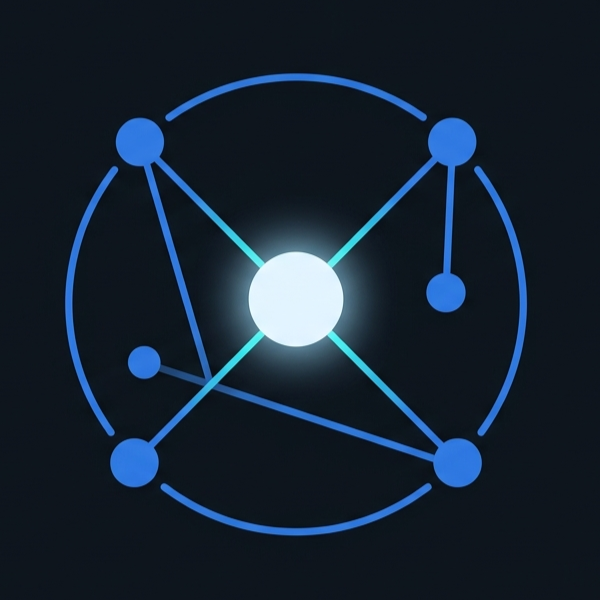
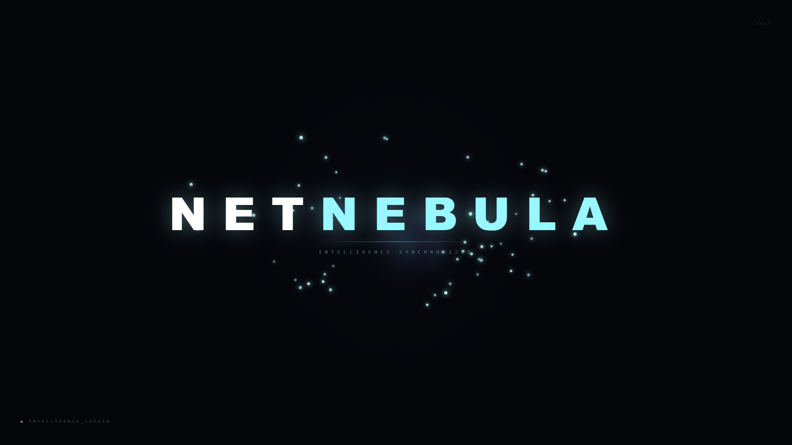
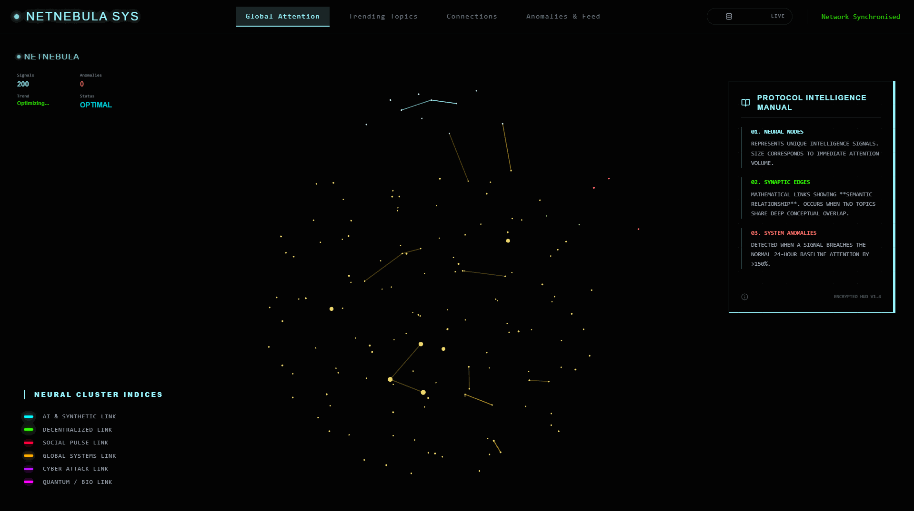
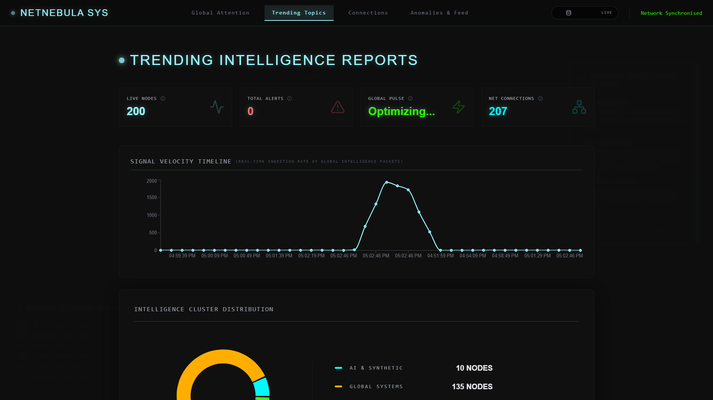
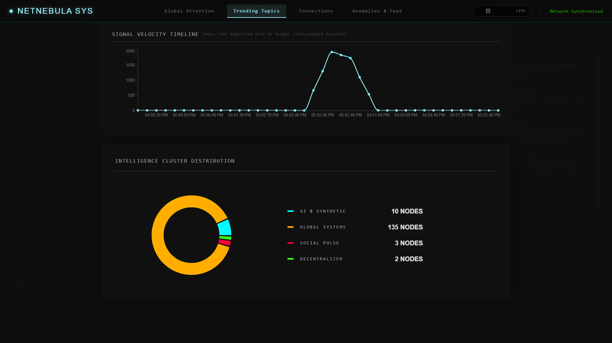
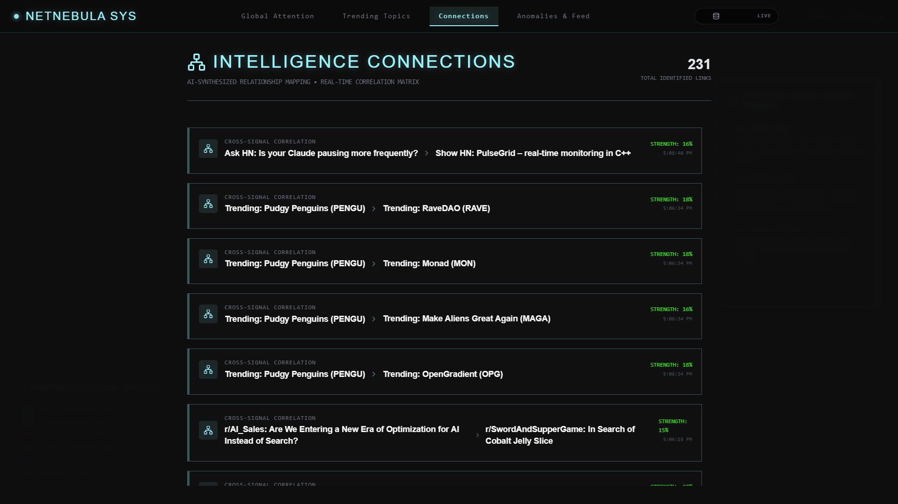
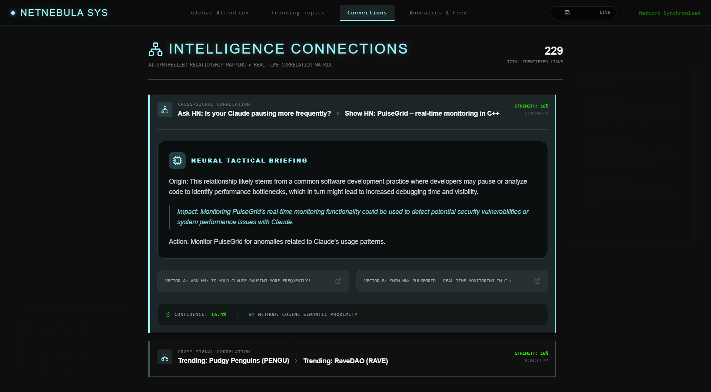
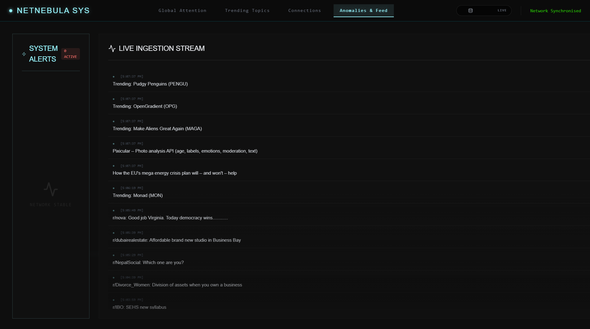

<div align="center">
  
  <h1>NetNebula</h1>
  <p><strong>A living cyber intelligence brain visualizing global digital consciousness in real time.</strong></p>
  
  <p>
    
    
    
    
    
  </p>
</div>

---

## 📌 Introduction

**NetNebula** is a real-time data analysis and visualization web application that transforms live internet data into an **interactive neural-like system**. The purpose of the application is to help users **understand global digital activity instantly** by visualizing trends, relationships, clusters, and anomalies in a dynamic and intuitive way.

Instead of traditional dashboards, NetNebula presents data as a **living system of interconnected signals**, making complex information easier to interpret visually rather than reading raw data tables.

---

## 📸 Interface Preview

### 📽️ Initialisation Sequence
<div align="center">
  
  <p><em>The cinematic entry sequence where digital data evolves into structured intelligence.</em></p>
</div>

### 🌐 Global Attention Matrix (Neural Evolution)
<div align="center">
  <p>A dynamic, real-time neural field visualizing the adaptive flow of global digital consciousness.</p>
  
</div>

### 📈 Trending Intelligence & Analytics
<div align="center">
  <p>Deep-dive analytics tracking sector momentum, signal velocity, and emerging narratives.</p>
  
  <br/>
  <br/>
  
</div>

### 🔗 Semantic Connections & Anomalies
<div align="center">
  <p>Detecting hidden mathematical links between disparate global topics and surfacing critical system anomalies.</p>
  <table border="0">
    <tr>
      <td></td>
      <td></td>
    </tr>
  </table>
  
</div>

---

## 🚀 Features & Visualization Layer

### 🌌 1. The Neural Field (Main Interactive View)
The entire background of NetNebula is an interactive, animated 2D/3D environment representing streaming digital thoughts.
* **Nodes:** Represent individual signals processed from the internet (Reddit threads, Crypto movements, HackerNews payloads).
* **Node Size:** Represents the weight, importance, or engagement of that specific topic.
* **Connections:** Glowing animated lines connecting nodes representing a strong algorithmic correlation (Semantic Similarity) between two disparate signals.

### 📈 2. Interactive Analytics Dashboard (Trending Topics)
By clicking on the "Trending Topics" tab, users are presented with a glassy immersive dashboard detailing macro-level metrics:
* **Live Nodes (Total Signals):** The complete volume of intelligence units currently held in the actively rolling memory pool.
* **Total Alerts (Anomaly Count):** High-velocity surges in digital chatter that breach normal mathematical baselines.
* **Sector Momentum Briefings:** Individual trend cards that detail expanding topics (e.g. "Bitcoin", "Nvidia GPU") and their relative % momentum drift tracking positive or negative trajectory. High-velocity cards display detailed AI Tactical Intelligence Briefings explaining why the node is growing.
* **Signal Velocity Timeline:** A moving-average line chart tracking the ingestion intensity over time to reveal pulse windows of global digital activity.

### 🔴 3. Live Anomalies & Feed Engine
An auto-updating cyber-terminal feed capturing critical anomalies (Signals whose volume exceeds `1.5x` their moving average baseline). Triggers a full-screen ripple/flash visualization when extremely severe anomalies populate.

### 🔗 4. Correlation Visualizer & Connections Tab
Dedicated tracking for the intelligence engine. When crypto volatility correlates directly with specific Reddit AI discussion algorithms, the backend explicitly links them and assigns an insightful LLM-generated briefing explaining the exact overlap in vectors.

---

## ⚙️ How the System Works (Under the Hood)

### 📡 Data Layer (The Inputs / Parameters)
The application polls real-time public telemetry data every 10 seconds:
1. **Reddit (`/r/all`)**: Capturing live, highly-discussed public posts based on upvote/comment ratios.
2. **CoinGecko**: Scanning the market for top-trending cryptocurrency searches.
3. **HackerNews**: Fetching the latest heavy-hitting technological breakthroughs and exploits.

All ingested structures map functionally to:
`source` (Origin API), `title` (Target topic), `value` (Score / Math representation of attention), `timestamp`, and `category` (The structural Matrix cluster it belongs to).

### 🧠 Processing Layer (The Backend Math)
All data flows into the Node.js+Express backend mapping to a standardized Schema.
* **Categorization (Clusters):** The system tokenizes signal titles and matches them into matrices like "AI & SYNTHETIC", "DECENTRALIZED ASSETS", or "CYBERSECURITY".
* **Anomaly Engine:** Z-score style tracking. If a topic suddenly spikes past `1.5x` its moving average engagement, it is recorded as an `ANOMALY`.
* **TF-IDF Semantic Engine:** The backend generates TF-IDF feature vectors for incoming signals strings. 
* **Cosine Similarity Correlation:** By measuring the Cosine angle between two signal feature vectors, we determine semantic linkage. If similarity exceeds `0.15` and occurs simultaneously, a `Correlation` is minted and injected into the Node Map.

### ⚡ Synthetic Demonstration Engine
There is a **SYNTH DATA ON/OFF** toggle located at the top-right of the frontend UI.
* Because real-time telemetry moves slowly, toggling this to **ON** orders the backend to perform a hard database flush and spin up the Artificial Storm Engine.
* The backend will automatically emulate intense, highly interconnected digital clusters at massive volumes, resulting in a dramatic, hyper-active visual demonstration of the Neural network and its connections algorithm. 

---

## 🏗️ Technical Architecture & Stack

### Frontend
* **React (Vite):** Core framework execution.
* **TailwindCSS & Framer Motion:** Heavy visual polishing, glassmorphic styling, and complex layout animations.
* **Three.js (react-three-fiber):** Optional/Core integration for deep spatial rendering of the Neural structures.
* **Recharts:** Clean, styled data visualization.
* **Lucide-react:** Component SVG iconography.

### Backend
* **Node.js + Express:** API framework polling remote sources continuously.
* **Mongoose (MongoDB):** Rolling memory pool storage. (Drops old signals to prevent memory bleed, caches correlations and anomaly records).
* **Natural.js:** NLP processing for TF-IDF extraction.
* **Ollama (Optional Local LLM):** If running, uses `phi3:mini` to construct hyper-contextual explanations for why two vectors correlated. If not running, relies on an algorithmic text generator.

---

## 📋 Running the Project Locally

This application is fully Dockerized for immediate deployment.

1. Clone or clone-mount the project directory.
2. Ensure you have Docker and `docker-compose` installed locally.
3. Open a terminal in the root directory and execute:
```bash
docker-compose up --build
```
4. Wait for Docker to orchestrate the internal network and boot the `MongoDB` database cache, the `Node.js Backend` (`:3001`), and compile the `Vite/Nginx Frontend` (`:80`).
5. Open your web browser and navigate to `http://localhost`.

*Enjoy exploring the digital consciousness!*
